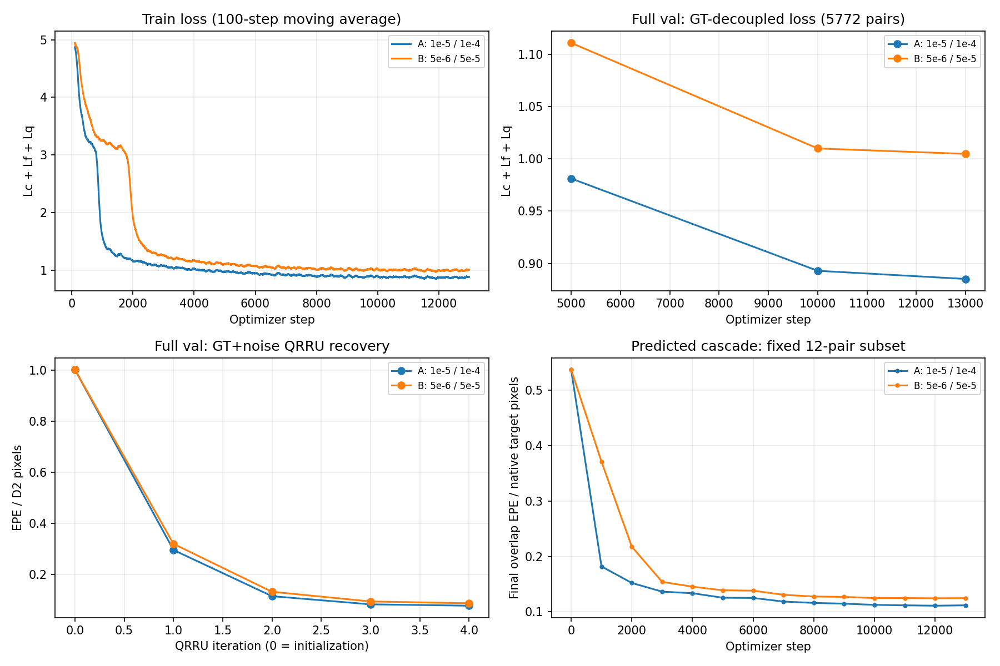

# 第一档下游学习率对照结果（2026-09-23）

两组均完成12995优化步、51978对train、5772对最终val，以及12对固定样本纯预测级联诊断。初始化、数据顺序、冻结策略相同；A的CGMDP/下游学习率为1e-5/1e-4，B为5e-6/5e-5。运行登记见 `artifacts/semidense_tier1_lr_compare_registration.json`。

结论：当前单次seed0、相同训练预算下，A优于B，优先选A作为后续初始化。尚不能据此推出更大学习率必然更好，或等价于跨数据集优势。

| 指标 | A | B |
|---|---:|---:|
| 末1000步训练Lc | 0.13338 | 0.15513 |
| 末1000步训练Lf | 0.21588 | 0.24993 |
| 末1000步训练Lq | 0.53024 | 0.59814 |
| 全val总损失 | 0.88521 | 1.00470 |
| 全val Lc | 0.13500 | 0.15601 |
| 全val Lf | 0.21874 | 0.25178 |
| 全val Lq | 0.53147 | 0.59691 |
| 全val GT+扰动QRRU最终EPE，D2像素 | 0.07688 | 0.08634 |
| 全val GT+扰动QRRU最终EPE P90，D2像素 | 0.10119 | 0.11378 |

A全val总损失低11.89%；Lc/Lf/Lq分别低13.47%/13.12%/10.96%。验证总损失在5000→10000→12995步持续下降：A 0.98118→0.89299→0.88521，B 1.11075→1.00988→1.00470。没有出现本轮记录的验证总损失反弹。上述QRRU验证使用GT+随机扰动，不能当作完整匹配系统误差。

12对固定验证样本的纯预测级联结果（非完整val）：

| 指标 | A | B |
|---|---:|---:|
| Fine EPE，原图目标像素 | 0.47756 | 0.48312 |
| QRRU后EPE，原图目标像素 | 0.11168 | 0.12474 |
| Fine precision@1px | 94.9563% | 94.6944% |
| QRRU后precision@1px | 99.9604% | 99.9340% |

A在12/12对中的最终EPE低于B。两组fine都输出12000点；A最终平均11999.9167点（总计剔除1点），B仍12000点，比较时保留这个差异。粗层EPE接近（A 2.26472，B 2.27097），不能把粗损失的相对下降等同于粗坐标误差同幅下降。

后续建议：先对A/B做同一完整val的纯预测级联评估，再确定用于第二档的主线。现有证据支持A优先；本次只比较和记录结果，不启动新训练或更改checkpoint。

原始汇总：`artifacts/semidense_lr_comparison/summary.json`。曲线：

